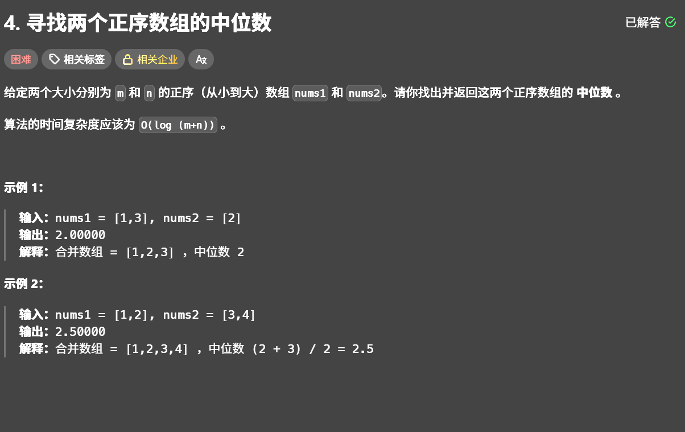

# 2026.2.15

## leetcode-04



### 暴力解法
1. extendd方法合并两个数组
2. sort方法排序
3. 判断长度奇偶后直接求
4. 时间复杂度分析：取决于sort方法的时间复杂度，即$O((m + n)\log(m + n))$
> python中sort方法特别擅长处理“部分已经排好序”的数组，故此题会非常适合

### 二分查找（正解，符合题目时间复杂度的要求）
- 规定个数如果是偶数个即左边永远比右边多一个
- 为了确保最快始终在较短的列表上做二分查找
- 注意边界条件的判断
```python
l1 = float('-inf') if i == 0 else nums1[i-1]
r1 = float('inf') if i == m else nums1[i]
l2 = float('-inf') if j == 0 else nums2[j-1]
r2 = float('inf') if j == n else nums2[j]
```
- **注意上述代码中列表脚标是从0开始的，所以求出的个数-1才是位置坐标**
所以一般步骤是：
1. 先确定查找的初始边界
```python
left = 0
right = len(nums1)
```
2. 运用while循环，终止条件是$left < right$
3. while循环里确定正中间值位置
根据规定规定个数如果是偶数个即左边永远比右边多一个：使用
```pyhton
(left+right+1)//2
```
**这么做可以简化代码，不用预先判断奇偶而直接求出所要的正中间值**

4. 判断是否$l1 < r2$而且$l2 < r1 $
- 如果已经满足则输出要求的值
- $l1 > r2$则
```python
right = i-1
```
此时搜索范围直接减小一半，因为l1太大而不不满则提议则可能的区间范围不是原来的所有值而是从0到$i-1%,因为i往后的值还是大于i
-$l2 > r1$则同理
```python
left = i+1
```
### 正解源码展示
```python
class Solution:
    def findMedianSortedArrays(self, nums1, nums2):
        if len(nums1)>len(nums2):
            nums1,nums2 = nums2,nums1
        m,n  = len(nums1),len(nums2)
        left = 0
        right = m 
        total_left = (m+n+1)//2

        while left <= right :
            i = (left+right+1)//2
            j = total_left - i
            l1 = float('-inf') if i == 0 else nums1[i-1]
            r1 = float('inf') if i == m else nums1[i]
            l2 = float('-inf') if j == 0 else nums2[j-1]
            r2 = float('inf') if j == n else nums2[j]
            if l1<= r2 and l2<=r1:
                if (m+n)%2 == 0:
                    return (max(l1,l2)+min(r1,r2))/2
                else:
                    return max(l1,l2)
            elif l1 > r2:
                right = i-1
            elif l2 > r1:
                left = i+1
```

 